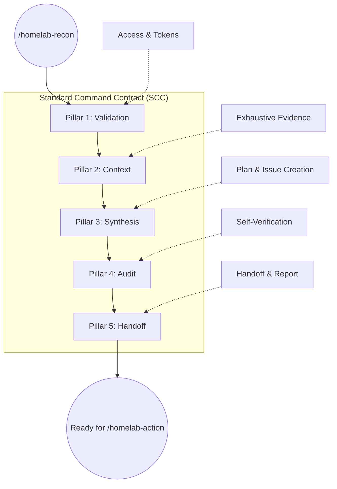

# Future Improvement Plan: Homelab Recon Command

This document is a **design blueprint for future upgrades** to the `/homelab-recon` command ([homelab-recon.md](file:///home/brimdor/Documents/Github/command-center/src/command_center/assets/commands/homelab-recon.md)). It outlines the proposed logic, data structures, and automation goals to make the command more robust and optimized for Agentic AI.

## Planning Objective
The goal is to evolve the current recon workflow into a streamlined, script-driven process that ensures the Gitea maintenance issue is exhaustive, prioritized, and perfectly formatted for `/homelab-action`.

## Proposed Target State (5 Pillars)

The improvement plan centers on organizing the current 8 phases of `homelab-recon.md` into five distinct automation pillars.

---

## The Script-First Imperative

To ensure **reliable and consistent results**, this workflow establishes a "Script-First" rule: **If a task can be performed by a script, it MUST be performed by a script.** Manual `kubectl` or `curl` commands should only be used as secondary diagnostics or when a script is being developed to replace them.

### Advantages of Scripting for Agents:
- **Idempotency**: Scripts can be safely re-run without unintended side effects.
- **Consistent Output**: Structured JSON output ensures the synthesis logic doesn't break due to text-parsing errors.
- **Reduced Context Load**: The AI doesn't need to process hundreds of lines of raw terminal output; it only processes the refined JSON.

---

## Proposed Pillar 1: Validation (System Prerequisites & Access)
*Target Mapping: Phase 1.1 - 1.2*

### Future AI Optimization Goals:
- **Auto-Mitigation**: The agent MUST check for required tools and **automatically install** any that are missing (e.g., using `apt-get`, `pip`, or downloading binaries).
- **Fail-Fast**: Enforce immediate termination only if connectivity or tokens are missing *after* tool mitigation attempts.
- **Explicit Auth Paths**: Provide direct commands for checking `GITEA_TOKEN` across different shells (bash/zsh/fish).

### Required Toolchain (Agent Must Install if Missing):
| Tool | Purpose | Auto-Install Strategy |
| :--- | :--- | :--- |
| `kubectl` | Cluster interaction | Download official binary & move to path. |
| `jq` | JSON parsing (Critical) | `sudo apt-get install -y jq` |
| `curl` | API requests | `sudo apt-get install -y curl` |
| `ssh` | Remote access | `sudo apt-get install -y openssh-client` |
| `make` | Makefile execution | `sudo apt-get install -y make` |
| `python3` | Synthesis scripting | `sudo apt-get install -y python3` |
| `pip` | Python package manager | `sudo apt-get install -y python3-pip` |
| `PyYAML` | Python lib for YAML | `pip install PyYAML` |
| `requests` | Python lib for API | `pip install requests` |
| `smbclient` | NAS share verification | `sudo apt-get install -y smbclient` |
| `nmap` | Network diagnostics | `sudo apt-get install -y nmap` |
| `argocd` | GitOps drift detection | Download binary from GitHub releases. |

### Planned Requirements:
- [ ] Verify **All Tools** in the toolchain are present (installing any missing ones).
- [ ] Verify `kubectl cluster-info` reaches the correct cluster.
- [ ] Verify SSH access to the controller (`10.0.20.10`).
- [ ] Verify Gitea REST API connectivity using the token in `~/.config/gitea/.env`.

---

## Proposed Pillar 2: Context (Exhaustive State Gathering)
*Target Mapping: Phase 1.3 - 1.10*

### Future AI Optimization Goals:
- **Standardized Evidence**: Transition from "capture output" to "save to file" for persistent context.
- **Structured Snapshots**: Transition to JSON-first gathering to allow Pillars 3 and 4 to programmatically audit findings.

### Script Inventory & Goals:
| Component | Primary Script | Target Output | Status |
| :--- | :--- | :--- | :--- |
| **Metal** | `recon.sh --nodes` | `nodes.json` | [x] Existing |
| **Network** | `homelab-network-check.sh` | `network.json` | [x] Existing |
| **Storage** | `recon-storage.sh` (Unifies NAS & Ceph) | `storage.json` | [ ] **New** |
| **System** | `recon-system.sh` (CNI, Kernel, Kube-System) | `system.json` | [ ] **New** |
| **Platform** | `recon-platform.sh` (Ingress, Certs, Secrets) | `platform.json` | [ ] **New** |
| **Apps** | `recon-apps.sh` (User Workloads) | `apps.json` | [ ] **New** |
| **Repo** | `recon-gitea.sh` (Proposed) | `repo.json` | [ ] **New** |

---

## Proposed Pillar 3: Synthesis (Logic & Decision Making)
*Target Mapping: Phase 2 - 5*

### Future AI Optimization Goals:
- **Scripted Generation**: Use `homelab-maintenance-issue.py` to convert `maintenance-data.yaml` into the Gitea issue body.
- **Template Enforcer**: Ensure the script handles all markdown formatting to prevent contract breaches.
- **Atomic Task Creation**: Enforce that every checkbox item generated follows the contract.

### Proposed Synthesis Mapping Logic:
| Finding Environment | Severity | Priority | Action Item Placement |
| :--- | :--- | :--- | :--- |
| Node NotReady | Critical | **P0** | Metal Section |
| Ceph HEALTH_ERR | Critical | **P0** | Storage Section |
| Internet Down | Blocking | **P0** | Network Section |
| DB Pod Crash | High | **P1** | Apps Section |
| Security PR | High | **P1** | Repo Section |
| Version Update PR | Medium | **P2** | Repo Section |

---

## Script Conversion Opportunities

Based on the [homelab-recon.md](file:///home/brimdor/Documents/Github/command-center/src/command_center/assets/commands/homelab-recon.md), the following manual operations are targets for future scripting to enhance AI reliability:

### 1. Unified Health Snapshot (`recon-unified.sh`)
Currently, `recon.sh`, `network-check.sh`, and `nas-check.sh` are separate.
- **Goal**: A single script that orchestrates all others and produces a single `recon-snapshot.json`.
- **Benefit**: Eliminates the "Alternative: Manual Commands" sections entirely.

### 2. Gitea Evidence Scraper (`recon-gitea.sh`)
Currently, the AI runs multiple `curl` commands to list PRs, Issues, and Dashboard contents.
- **Goal**: A script that fetches all repo context into a structured JSON format.
- **Benefit**: Ensures no PR or Dependency Dashboard item is missed due to paginated or complex output.

### 3. Automated Error Diagnostics (`recon-diagnostics.sh`)
Currently, the AI manually runs `kubectl logs` and `describe` on failing pods.
- **Goal**: A script that identifies unhealthy pods and automatically fetches logs/describe output into the snapshot.
- **Benefit**: Provides immediate context for the Synthesis pillar without extra tool calls.

---

---

## Proposed Pillar 4: Audit Rules (Quality Control)
*Target Mapping: Phase 6 - 7*

### Future AI Optimization Goals:
- **Zero Tolerance Checklist**: Enforce that the AI must verify its own work before presenting it.
- **Remediation Loop**: Plan for the agent to return to Pillar 2 or 3 if the audit fails.

### Proposed Mandatory Audit Checks:
- [ ] Every non-GREEN finding has a corresponding P0/P1 task.
- [ ] All checkboxes are top-level and follow the contract.
- [ ] Rollback commands are specific (no "N/A" for risky changes).
- [ ] Priority ordering is correct (P0 -> P3).
- [ ] The Gitea issue body was **edited**, not commented on.
- [ ] **Validation Gate: Metal** - All nodes Verification step is present.
- [ ] **Validation Gate: Network** - All checks Verification step is present.
- [ ] **Validation Gate: Storage** - Ceph Health & NAS Reachability step is present.
- [ ] **Validation Gate: System** - Core Pods Verification step is present.
- [ ] **Validation Gate: Platform** - Ingress/Certs Verification step is present.
- [ ] **Validation Gate: Apps** - All Apps Synced/Healthy Verification step is present.

---

## Proposed Pillar 5: Handoff (Artifact Delivery)
*Target Mapping: Phase 8*

### Future AI Optimization Goals:
- **Persistent Artifacts**: Standardize the location and format of the raw evidence archive.
- **Status Reporting**: Implement a clear "Recon Complete" summary for the user.

---

## Failure Mode Planning (For Agents)

| Incident | Agent Routine |
| :--- | :--- |
| **Access Fail** | Report error, identify missing token/key, and HALT. |
| **Ceph Down** | Gather `ceph health detail` and operator logs immediately. |
| **Missing Schema** | Use best-effort manual capture but flag as an audit warning. |
| **Duplicate Issue** | Locate existing issue and merge findings into the body. |

---

---

## Creative Expansion: Advanced AI-Driven Improvements

Beyond standard automation, these proposed features leverage the unique capabilities of Agentic AI to provide a "proactive" rather than just "reactive" recon.

### 1. Proposed "Phase 0": Predictive Health & Drift Detection
*Goal: Detect issues before they cause pod failures.*
- **Predictive Analytics**: Scripts should capture `kubectl top` trends. If memory usage on a node has grown by 20% in the last 24 hours, the Synthesis pillar should flag a "P2 Investigation" for potential memory leaks.
- **GitOps Drift Detection**: In Pillar 2, the agent should compare the live cluster state against the `ops/homelab` repo using `argocd app diff`. Any unmanaged changes should be flagged as "Unauthorized Drift" (P1).

### 2. Interactive "Deep-Dive" Suggestion Tree
*Goal: Reduce the time from "Finding" to "Fix".*
- **Diagnostic Hints**: When Pillar 3 identifies an issue (e.g., `CrashLoopBackOff`), it shouldn't just create a task. It should propose a specific **Diagnostic Command** for the user or next agent to run (e.g., `kubectl debug node/...`).
- **Knowledge Base Integration**: The Synthesis pillar should cross-reference findings with a (future) `TROUBLESHOOTING.md` or previous Gitea issues to see if this error has a known recurring fix.

### 3. Proposed "Pillar 6": The Feedback Loop & Knowledge Base
*Goal: Make the system smarter after every recon.*
- **Outcome Tracking**: After a maintenance window is finished, the next `/homelab-recon` should verify that the *previous* P0 findings are actually resolved.
- **Auto-Updating Skip List**: The AI should have the ability to propose "known safe to ignore" labels for noisy logs that don't impact health, refining the signal-to-noise ratio over time.

### 4. "Recon-as-Code" (Configurable Checksets)
*Goal: Allow the user to "tune" the recon sensitivity.*
- **Profile-Based Recon**: The user could specify `--profile=thorough` (deep log dives) or `--profile=quick` (ready-checks only).
- **Custom Health Assertions**: Allow users to define simple YAML files in `.agent/recon/assertions.yaml` that the scripts must verify (e.g., "Ensure Pod X always has exactly 3 replicas").

---

## Technical Feasibility & Agent Optimization

| Feature | Target AI Optimization | Complexity |
| :--- | :--- | :--- |
| **Drift Detection** | Eliminates "surprise" manual changes. | Medium |
| **Predictive Trends** | Prevents pager-worthy outages. | High |
| **Diagnostic Hints** | Shortens the remediation loop. | Low |
| **Skip-List (Noise Reduction)**| Increases AI accuracy and focus. | Medium |

---

## Atomic Execution Strategy (Small Model Optimization)

*Goal: Enable smaller, faster, and cheaper models to execute this workflow reliably.*

To avoid context window exhaustion and "lost in the middle" hallucinations, the `homelab-recon.md` command must be architected as a series of **Stateless Atomic Tasks**.

### Phase 1: Validation (The Gatekeeper)
*Goal: Fail fast before loading any heavy context.*
- **Task 1.1**: Check Local Toolchain (Install `kubectl`, `jq`, `argocd` if missing).
- **Task 1.2**: Verify Connectivity (SSH, K8s API, Gitea API).
- **Task 1.3**: Authenticate (Ensure tokens are valid).

### Phase 2: Context Gathering (The Scribe)
*Goal: Dump raw data to disk. The agent DOES NOT read the output.*
- **Task 2.1**: Run `recon-metal.sh` → Save `context/metal.json`.
- **Task 2.2**: Run `recon-system.sh` → Save `context/system.json`.
- **Task 2.3**: Run `recon-platform.sh` → Save `context/platform.json`.
- **Task 2.4**: Run `recon-apps.sh` → Save `context/apps.json`.
- **Task 2.5**: Run `recon-storage.sh` → Save `context/storage.json`.
- **Task 2.6**: Run `argocd app diff` (Drift) → Save `context/drift.json`.

### Phase 3: Synthesis (The Analyst)
*Goal: Process one file at a time. "Load One, Write One, Forget".*
- **Task 3.1**: Load `metal.json` → Identify unhealthy nodes → Append to `p0_tasks.yaml` → **Clear Context**.
- **Task 3.2**: Load `system.json` → Identify crashed pods → Append to `p0_tasks.yaml` → **Clear Context**.
- **Task 3.3**: Load `storage.json` → Check Ceph Health → Append to `p0_tasks.yaml` → **Clear Context**.
- **Task 3.4**: Load `drift.json` → Flag unmanaged resources → Append to `p1_tasks.yaml` → **Clear Context**.

### Phase 4: Audit & Handoff (The Closer)
*Goal: Validating the final artifact.*
- **Task 4.1**: Merge all `*.yaml` fragments into `maintenance-issue.yaml`.
- **Task 4.2**: Verify "Validation Gates" exist for every task.
- **Task 4.3**: Verify strict P0→P3 ordering.
- **Task 4.4**: Execute `homelab-maintenance-issue.py` to push to Gitea.

### Dynamic Task Tracking (State Management)
*Goal: Provide a persistent "Brain" for the agent to track its own progress.*

1.  **Initialization**: At the start of Phase 1, the agent MUST generate `recon-tasks.md` from a standard template/script. this file will contain all Phases and Tasks listed above.
2.  **Execution Loop**:
    *   **Read**: Agent reads `recon-tasks.md` to find the next unchecked item (`- [ ]`).
    *   **Execute**: Agent performs the task.
    *   **Update**: Agent marks the item as complete (`- [x]`) in `recon-tasks.md`.
3.  **Finalization**: When all items are `[x]`, the agent MUST append the content of `recon-tasks.md` to `reports/status-report-YYYY-MM-DD.md`.
    *   This serves as the "Execution Log" within the status report.
    *   The `recon-tasks.md` file can then be cleaned up.

**Template Location**:
The template for this task list should be stored at `templates/recon-tasks-template.md` (to be created).

